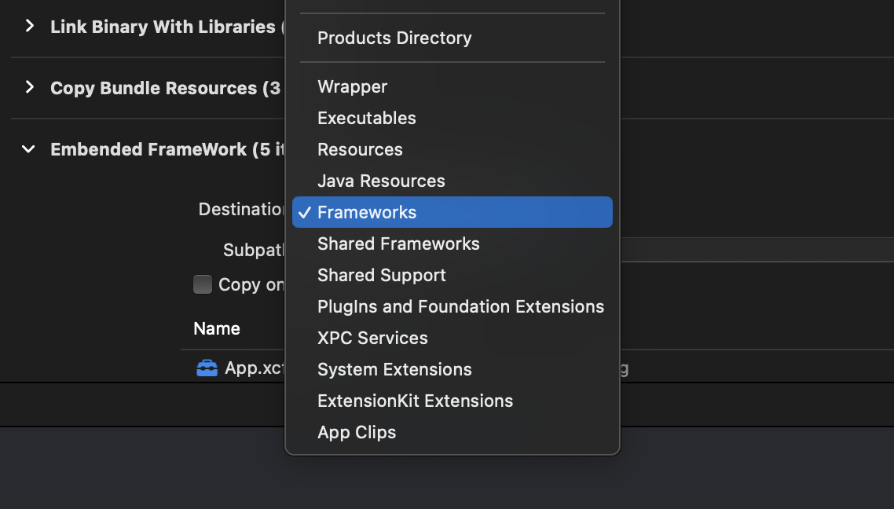

# metafy_edge_detection_module

A new Flutter module project.

## Getting Started

# How to add flutter module to android app.

## 1) Generate Build file using 'flutter build aar' command.

## 2) Goto your android project root folder and create the new folder name as Document_scanner.

## 3) Go back to the flutter module.

and open the build folder inside the build/host/outputs/repo have 'biz' and 'com' folders
copy those two folders in to the android project past it inside the 'Document_scanner' folder

## 4) open the build.gradle(app) file and in side the dependencies past this and sync

    implementation 'androidx.core:core-ktx:1.8.0'
    implementation 'androidx.appcompat:appcompat:1.6.1'

    debugImplementation 'com.example.metafy_edge_detection_module:flutter_debug:1.0'
    profileImplementation 'com.example.metafy_edge_detection_module:flutter_profile:1.0'
    releaseImplementation 'com.example.metafy_edge_detection_module:flutter_release:1.0'

## 5) open the setting.gradle files int to the dependencyResolutionManagement

    repositories {
        google()
        mavenCentral()
        maven { url "https://jitpack.io" }

        maven {
            url    './document_scanner'
        }

        maven {
            url 'https://storage.googleapis.com/download.flutter.io'
        }

    }

# How to add flutter module to ios app.

## 1) go to the flutter module

## 2) open Podfile inside of the .ios folder and change the platform :ios version to 13 or higher version

## 3) go back to the module and inside the terminal run

    'flutter build ios-framework --output=YOUR_MODULE_PATH/MyApp/Flutter/'
    it will generate the ios framework

## 4) Inside the FLutter folder have Debug, Release, Profiles folders

    Copy the Debug and Release folders

## 4) And got to your ios project and create 'Document_scanner'file on the root and past the Debug and Release folders

## 5) If your running in debug mode open the debug folder and drag the folders in to your root file

## 6) Goto Build Phases and Click on Add Button

## 7) Add new Copy Files Phase and name it 'Embended Framework' and change Destination to 'Frameworks'

## 8) Again open the debug folder and drag and drop the files after drop it it will show like this

## after your folder structure will like this.

